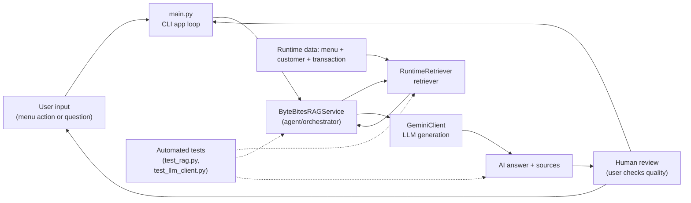

# ByteBites AI System Diagram

```mermaid
flowchart LR
    U["User input\n(menu action or question)"] --> APP["main.py\nCLI app loop"]

    APP --> AGENT["ByteBitesRAGService\n (agent/orchestrator)"]
    AGENT --> RET["RuntimeRetriever\n retriever"]
    DATA["Runtime data: menu + customer + transaction"] --> RET
    RET --> AGENT

    AGENT --> LLM["GeminiClient\n LLM generation"]
    LLM --> OUT["AI answer + sources"]

    OUT --> HUM["Human review\n (user checks quality)"]
    HUM --> U

    HUM --> APP

    TEST["Automated tests\n (test_rag.py, test_llm_client.py)"] -.-> RET
    TEST -.-> AGENT
    TEST -.-> OUT
```
